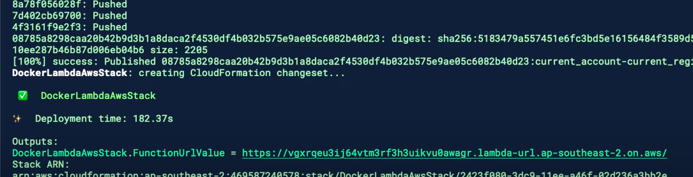

# Welcome to your CDK TypeScript project

This is a blank project for CDK development with TypeScript.

The `cdk.json` file tells the CDK Toolkit how to execute your app.

## Useful commands

* `npm run build`   compile typescript to js
* `npm run watch`   watch for changes and compile
* `npm run test`    perform the jest unit tests
* `npx cdk deploy`  deploy this stack to your default AWS account/region
* `npx cdk diff`    compare deployed stack with current state
* `npx cdk synth`   emits the synthesized CloudFormation template

## Init

```bash
npx aws-cdk init app --language typescript
```

## Create a App

```bash
cd docker-image
# run docker (Mac, m2)
docker build --platform linux/amd64 -t docker-image:test .
docker run --rm -p 9000:8080 docker-image:test

# test
curl "http://localhost:9000/2015-03-31/functions/function/invocations" -d '{}'
```

## Deploy to AWS

```bash

## prepare
aws sts get-caller-identity
npx aws-cdk bootstrap --region ap-southeast-2

## deploy and  try out
npx aws-cdk deploy
```

