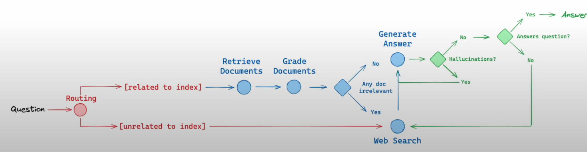
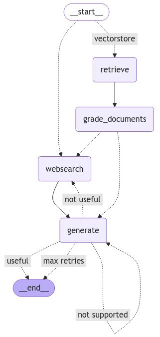

# local RAG agents with LLaMA3.2-3b using LangGraph

- Answer common questions by searching the web
- Maintain conversation state across calls
- Route complex queries to a human for review
- Use custom state to control its behavior
- Rewind and explore alternative conversation paths

(Source Link)[https://langchain-ai.github.io/langgraph/tutorials/rag/langgraph_adaptive_rag_local/]

## Flow

LangGraph Workflow

## Search
For search, we use Tavily, which is a search engine optimized for LLMs and RAG.

