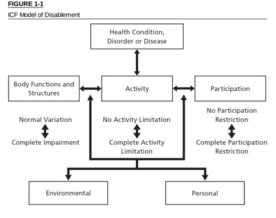
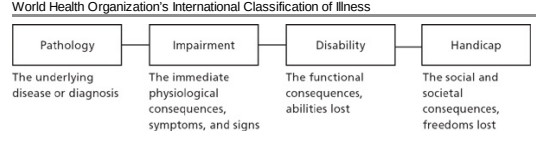

# Conceptual Foundations And

 Philosophy

1.1 History of the *Guides* 1.2 New Directions for the Sixth Edition 1.3 The International Classification of Functioning, Disability, and Health
(ICF): A Contemporary Model of Disablement 1.4 Measurement Issues 1.5 Balancing Science and Clinical Judgment 1.6 The Case for Simplification and Ease of Application 1.7 The Application of Functional Assessment 1.8 The Need for Internal Consistency and a Uniform Template 1.9 Summary

## 1.1 History Of The Guides

Tolerance of and care for the sick and the disabled may be elemental components of our social fabric rooted in the very origins of human society. Anthropological evidence supports the notion that our earliest ancestors were afforded communal benefits in terms of improved odds of survival of hereditary and physical impairments that might otherwise prove fatal to the individual.1 The concept of compensation for personal injuries and resulting disabilities is hardly a contemporary one; historical evidence documents that social justice and compensation systems for injured parties have been around since recorded history.1,2 Since antiquity, from ancient Babylonian societies 4000 years ago to the Roman Empire many centuries later, lawgivers attempted to legislate justice in moral, social and economic spheres, which inter *alia* provided for pecuniary compensation.3 These various attempts to legislate monetary compensation for personal injuries were aimed at ridding the society of the blood feud and replacing it with a more civilized and enlightened system involving the exchange of monetary value for losses resulting from personal injuries. For example, the Lombard laws 2 millennia ago set forth monetary compensation values for all sorts of injuries, from minor loss such as teeth to the loss of eye and limbs. These systems even accounted for cosmetic loss, doubling the value of a lost tooth if it showed on smile.4 Such monetary compensation schemes, in terms of their whole person values, are strikingly similar to some of our contemporary systems of compensation for disablement.

The *Guides* reflects experience with impairment ratings over the centuries1,2 and started in 1958 with publication by the American Medical Association (AMA) of the article, A Guide to the Evaluation of Permanent Impairment of the Extremities and Back.5 Over the next 12 years, 12 additional guides appeared in *JAMA*, and in 1971 a compendium of these 13 guides became the First Edition of the *Guides*.6 The *Guides* is revised periodically to incorporate current scientific clinical knowledge and judgment. For example, the Third Edition, published in 1988, introduced pie charts for range of motion (ROM) impairment evaluation of the upper extremities.7 In 1993 the Fourth Edition introduced the Diagnosis-Related Estimates (DRE) or "injury" model to the evaluation of spinal injuries.8 A pain chapter was introduced in the Fourth Edition and refined in the Fifth Edition in 2000.9 The Fifth Edition modified the DRE method and expanded the ROM method for spinal impairment evaluations. The Sixth Edition represents this continued evolution and introduces a "paradigm shift" to the assessment of impairment.

## 1.2 New Directions For The Sixth Edition

1.2a Previous Criticisms of the *Guides* The *Guides* is revised to reflect the latest scientific research and evolving medical evidence. Earlier versions of the *Guides* were subject to criticisms,10–17 which included the following:
- There was a failure to provide a comprehensive, valid, reliable, unbiased, and evidence-based rating system.

- Impairment ratings did not adequately or accurately reflect loss of function. - Numerical ratings were more the representation of "legal fiction than medical reality."17 Recommended changes included:

American Medical Association AM, Genovese E, Brigham CR. Guides to the Evaluation of Permanent Impairment, Sixth Edition. Alpharetta: American Medical Association; 2007. 
- Standardized assessment of Activities of Daily Living (ADL) limitations associated with physical impairments.

- Application of functional assessment tools to validate impairment rating scales.

- Include measures of functional loss in the impairment rating.

- Overall improvements in intrarater and interrater reliability and internal consistency.14 Although attempts were made to correct these deficiencies in the Fifth Edition, problems persisted. These were attributable, in part, to adherence to antiquated and confusing terminology, limited validity and reliability of the ratings, lack of meaningful and consistent application of functional assessment tools, and lack of internal consistency.14 A high error rate among all ratings has been reported.18 In this edition there is a paradigm shift, which adopts a contemporary model of disablement; it is simplified, functionally based, and internally consistent to the fullest extent possible.

## 1.2B Five New Axioms Of The Sixth Edition

The vision embodied by this paradigm shift is articulated in terms of 5 specific new axioms. These axioms provide direction and define priorities:
1. The *Guides* adopts the terminology and conceptual framework of disablement as put forward by the International Classification of Functioning, Disability, and Health
(ICF).

19 2. The *Guides* becomes more diagnosis based with these diagnoses being evidence-based when possible.

3. Simplicity, ease-of-application, and following precedent, where applicable, are given high priority, with the goal of optimizing interrater and intrarater reliability.

4. Rating percentages derived according to the *Guides* are functionally based, to the fullest practical extent possible.

5. The *Guides* stresses conceptual and methodological congruity within and between organ system ratings.

## 1.3 The International Classification Of Functioning, Disability, And Health (Icf): A Contemporary Model Of Disablement 1.3A Icf Model

The World Health Organization (WHO) developed a comprehensive model of disablement, the International Classification of Functioning, Disability, and Health
(ICF)19; this classification is depicted in Figure 1-1. The ICF framework is intended for describing and measuring health and disability at the individual and population levels. It consists of 3 key components:
1. Body functions and body structures: physiological functions and body parts, respectively; these can vary from the normal state, in terms of loss or deviations, which are referred to as *impairments*.

2. Activity: task execution by the individual and activity *limitations* are difficulties the individual may experience carrying out such activities.

3. Participation: involvement in life situations and participation *restrictions* are barriers to experiencing such involvement.

These components comprise functioning and *disability* in the model. In turn, they are related interactively to an individual with a given health condition, *disorder,* or disease, and to environmental *factors* and personal *factors* of each specific case.19 1.3b Applications of ICF Model to the *Guides* Advantages of ICF Model The ICF model appears to be the best model for the *Guides*. It acknowledges the complex and dynamic interactions between an individual with a given health condition, the environment, and personal factors. The relationships between impairment, activity limitations, and participation are not assumed to be linear or unidirectional. An individual may experience measurable impairment without significant activity limitations that do not produce restrictions to major life activities such as work or recreation. On the other hand, one can experience significant activity limitations and/or participation restrictions in the absence of demonstrable impairment.

## History Of Models Of Disablement

The traditional model of disablement was based on the International Classification of Impairments, Disabilities, and Handicaps (ICIDH) that the WHO presented more than a quarter century ago.

20 This model, depicted in Figure 1-2, focuses on the individual and extends across 4 levels of disablement in linear fashion. The first level, pathology (a disease or trauma at the tissue level), is viewed as giving rise to impairment (an abnormality in anatomic or physiological structure or function at the organ system level). This, in turn, gives rise to disability (the functional consequences to the individual in terms of abilities lost) within one's personal sphere (ie, mobility; Activities of Daily Living, or ADLs); and eventually to handicap
(a disadvantage to a given individual in terms of role fulfillment) in their societal sphere (may include barriers or impediments to functioning in a major life activity, such as work).

14 The ICIDH model is overly simplistic and unidirectional. This unidirectional depiction of the relationships among impairments, disabilities, and handicaps implies causation and irreversibility; disabilities and handicaps can also give rise to impairments. The ICIDH model also lacks sufficient complexity to fully account for important environmental modifiers of a biological, psychological, and social nature.15 For example, the societal consequences of impairment may be substantially mitigated by environmental accommodations such as those mandated by the Americans with Disabilities Act,21 and by greater acceptance and enabling expectations.

## Interim Developments Of The Who And Institute Of Medicine

Saad Nagi 22 developed a conceptual model of disablement in the 1960s that was similar to the WHO model. It recognized that the correlations among impairments, functional limitations, and associated disabilities were poor. He suggested that environmental factors were important modifiers of this relationship, albeit in a unidirectional sense. In 1991 the Institute of Medicine (IOM) defined disability as "a function of the interaction of the person with the environment" and produced an interactive model of the "enabling-disabling process," which identified 3 independent modifiers, including biology (ie, heredity), environment (ie, physical, social, psychological),
and lifestyle and behavior.

23 In 1997, a second International Classification of Impairments, Disabilities, and Handicaps (ICIDH-2) was presented by the WHO.24 This model changed terminology of disablement (referencing impairments, disability, and handicap) to that of enablement (referencing impairments, activities, and participations). It provided unified and standard language to characterize the functional consequences of a variety of health conditions.24

FIGURE 1-2

Rondinelli RD, Duncan PW. The concepts of impairment and disability. In Rondinelli RD, Katz RT, eds. Impairment Rating and Disability *Evaluation*. Philadelphia, Pa: WB Saunders Co; 2000:19. Used with permission.

The ICF recognizes that limitations to participation may secondarily produce activity restrictions or impairments. It also recognizes the impact of environmental and personal factors to the consequences of disease. Activity limitations and participation restrictions are not static. They may vary over time and be influenced by numerous physical and psychological factors that may also vary over time.

The ICF model is designed to be enabling in its approach and etiologically neutral in addressing human functioning as well as disability. It is inclusive in dealing with personal and environmental determinants of health and disablement, and is causally interactive as opposed to linearly predictive of its constructs and associations.

## International Appeal And Applications

The ICF was developed out of a worldwide consensus process, which embodies broad cultural values and perspectives. The ICF model (unlike its predecessor, the ICIDH) was endorsed by the World Health Assembly in May 200125 and is now a member of the WHO Family of International Classifications. This acceptance reflects the increasing worldwide importance placed on recognition and reduction of burden of care associated with health conditions.

1.3c ICF Terminology and Definitions According to the ICF, the following terms and definitions apply:
- Body *functions:* physiological functions of body systems (including psychological functions).

- Body *structures:* anatomic parts of the body such as organs, limbs, and their components.

- *Activity:* execution of a task or action by an individual.

- *Participation:* involvement in a life situation.

- *Impairments:* problems in body function or structure such as a significant deviation or loss.

- Activity *limitations:* difficulties an individual may have in executing activities.

- Participation *restrictions:* problems an individual may experience in involvement in life situations.

1.3d Operational Definitions: Impairment, Disability, Handicap For purposes of the *Guides*, the following operational definitions and disclaimer apply:
Impairment: a significant deviation, loss, or loss of use of any body structure or body function in an individual with a health condition, disorder, or disease.

Disability: activity limitations and/or participation restrictions in an individual with a health condition, disorder, or disease.

Impairment rating enables the physician to render a quantitative estimate of losses to the individual as a result of their health condition, disorder, or disease. Impairment ratings are defined by anatomic, structural, functional, and diagnostic criteria; physicians are generally familiar with these criteria, based on their broader training and clinical experience. These ratings are determined by following accepted diagnostic processes and procedures. Most physicians are not trained in assessing the full array of human functional activities and participations that are required for comprehensive disability determinations. Impairment rating is a physician-driven first approximation of a process that attempts to link impairment with a quantitative estimate of functional losses in one's personal sphere of activity. As a result, the following operational definition will continue to apply: Impairment *rating:* consensus-derived percentage estimate of loss of activity reflecting severity for a given health condition, and the degree of associated limitations in terms of ADLs.

There are important remaining differences between the ICF and *Guides* terminology.

The ICF model depicts only an association between body function/structure, activity, participation, and a given health condition. Typically, in assessing impairment, the physician must determine if the health condition is causally related to an event or exposure. The relationship between impairment and disability remains both complex and difficult, if not impossible, to predict. In some conditions there is a strong association between level of injury and the degree of functional loss expected in one's personal sphere of activity (mobility and ADLs). The same level of injury is in no way predictive of an affected individual's ability to participate in major life functions (including work) when appropriate motivation, technology, and sufficient accommodations are available.

Disability may be influenced by physical, psychological, and psychosocial factors that can change over time.

The *Guides* is not intended to be used for direct estimates of work participation restrictions. Impairment percentages derived according to the *Guides'* criteria do not directly measure work participation restrictions. The intent of the *Guides* is to develop standardized impairment ratings to be used as follows:
1. Fix the diagnosis and associated percentage of physical and functional loss at
"Maximum Medical Improvement" (MMI) (see Chapter 2).

2. Enable a patient with an impairment rating to exit from a system of temporary disablement (eg, temporary total or partial disablement under workers' compensation before MMI).

3. Provide diagnosis and taxonomic classification of impairment as a segue into other systems of long-term disablement.

In disability evaluation, the impairment rating is one of several determinants of disablement. Impairment rating is the determinant most amenable to physician assessment; it must be further integrated with contextual information typically provided by nonphysician sources regarding psychological, social, vocational, and avocational issues.

## 1.3E Domains Of Personal Function

There are 2 domains of human personal function that are most often affected by impairments and for which well-accepted measurement tools exist, and hence they are of particular interest to the impairment rater. These are mobility and "self-care,"
which can be further defined and categorized as follows.26

## Mobility

Transfer: movement of one's body position while remaining at the same point in space (eg, supine to side lying, supine to sit, sit to stand).

Ambulation: movement of one's body from one point in space to another (eg, walking, stair climbing, wheelchair locomotion).

## Self-Care

Activities of Daily Living *(ADLs):* basic self-care activities performed in one's personal sphere (eg, feeding, bathing, hygiene, dressing; see Table 1-1).

Instrumental Activities of Daily Living *(IADLs):* complex self-care activities (eg, financial management, medications, meal preparation), which may be delegated to

American Medical Association AM, Genovese E, Brigham CR. Guides to the Evaluation of Permanent Impairment, Sixth Edition. Alpharetta: American Medical Association; 2007. 

## Examples Of Impairment And Disability

Christopher Reeve was a well known celebrity who suffered a traumatic spinal cord injury resulting in a high-level cervical tetraplegia, a condition that would have an unusually high expected impairment rating due to the near-complete activity limitations that typically accompany it. In his particular case, he required elaborate mobility and ventilatory assistive equipment and the 24-hour availability of a personal care attendant to assist with virtually all self-care activities. However, Mr. Reeve was highly exceptional in terms of his public persona and renown, and his access to significant personal financial assets and other resources. He was able to martial these constructively to create an education and research foundation for which he was the principal spokesperson, and to become globally recognized as a prime advocate for the spinal cord injured and disabled. His vocational success would be judged exceptional even for any able-bodied individual, and underscores the fact that participation restrictions do not correlate with activity limitations in many instances.

Similarly, a given physical impairment can be highly disabling in one vocational context and virtually non-disabling in another. For example, amputation of one's great toe might preclude the vocation of a ballerina who must dance "on point,"
whereas the same amputation might be of no functional consequence to a construction worker equipped with an appropriately fitted work boot.

These mobility and self-care activities may be performed independently (without the use of a helper or adaptive aids) or modified independently (require the use of adaptive aids but no helper), or they may require helper assistance with or without adaptive aids. The highest level of independence with which the given activity is consistently and safely carried out at the individual's baseline is considered the functional level for that individual.

27

## 1.4 Measurement Issues

Measurement issues are important determinants in defining impairment. The process of impairment rating relies on criteria that may be discrete (ie, amputation of a limb)
or continuous (ie, loss of range of motion). Severity of an impairment also can vary according to discrete (ie, level of amputation) or continuous (ie, degrees of motion lost) criteria. There are 4 levels of measurement whereby test results can be analyzed and interpreted, including nominal, ordinal, interval, and ratio.

28 Nominal and ordinal scales are used to classify discrete measures because the scores they produce occupy mutually exclusive categories. Interval and ratio scales apply to continuous measures because the scores produced occupy points on a continuum within an available range of scores.12 TABLE 1-1 Self-Care Activities of Daily Living (ADLs)
Bathing, showering Bowel and bladder management Dressing Eating Feeding Functional mobility Personal device care Personal hygiene and grooming Sexual activity Sleep/rest Toilet hygiene Instrumental Activities of Daily Living (IADLs) Care of others (including selecting and supervising caregivers) Care of pets Child rearing Communication device use Community mobility Financial management Health management and maintenance Home establishment and maintenance Meal preparation and cleanup Safety procedures and emergency responses Shopping Source: Youngstrom.

26 Precision, accuracy, reliability, and validity are critical issues in defining impairment. Precision refers to the smallest unit of change that a measurement instrument can distinguish. Sensitivity to change is critical to the measurement of the clinical effects of treatment, and the sensitivity of a measurement scale should be appropriate to the level of precision required in a given case. Reliability is the extent to which a measurement provides consistent information. Validity is the extent to which an instrument measures that which it is intended to measure.

Measurement Scales American Medical Association AM, Genovese E, Brigham CR. Guides to the Evaluation of Permanent Impairment, Sixth Edition. Alpharetta: American Medical Association; 2007. 

Nominal scales categorize items into different, internally equivalent groups based on a single criterion. They may be dichotomous (ie, 1 of 2 possible groups such as male vs female) or non-dichotomous (ie, the colors of the spectrum). Ordinal scales categorize items hierarchically, based on order of magnitude, where intervals between groups are not assumed to be equal and the order of magnitude may differ for each group. Ordinal scales are most commonly used in clinical practice and are typical of the self-report functional outcome scales being adopted here. Interval scales, by contrast, are continuous scales, which are rank ordered according to uniform and sequential units of increment (ie, temperature scale).

Ratio scales are interval scales whose zero point reflects absence of the quantity being measured.

12 Analysis of nominal and ordinal data requires special considerations to avoid mistaken inference of the results.

29,30 Controversy surrounds summation and averaging of subtest scores to produce an overall result for comparative purposes. As such, continuous-scale measures lend themselves more readily to rigorous statistical analysis than is possible for discrete counterparts.

12 Since the comparative data being drawn upon for some organ systems of the *Guides* remain largely discrete, by nature, and have not been subjected to appropriate Rasch analysis or other manipulations, the use of normative statistics (eg, means, standard deviations) for comparative purposes in such cases remains problematic and will be avoided.

Previous work examining the validity of musculoskeletal impairments derived according to the *Guides* has yielded equivocal results.15,32,33 One study33 examined the validity of hand impairments due to loss of ROM or to amputation, and in terms of correlations of impairment ratings and objective measures of hand function. Approximately two thirds of the correlations were significant; hence, these results were touted as a validation of impairment ratings. However, the R2 coefficients derived from these correlations (amount of variance actually "explained" in terms of these correlations and regressions) were quite low (exceeded .5 in only 8% of correlations.) Another similar study32 showed significant correlations between lower extremity impairments associated with fractures and measures of functional performance as well as limitations measured on the Sickness Impact Profile (SIP).

Again, these results were used to tout validity. However, the associated R2 coefficients were again quite small (R2 = .32 and .30, respectively).

## Precision And Accuracy

Consideration must be given to feasibility and practicality of achieving a given level of precision, including cost and availability of equipment, and time required and

American Medical Association AM, Genovese E, Brigham CR. Guides to the Evaluation of Permanent Impairment, Sixth Edition. Alpharetta: American Medical Association; 2007. 